Tutorial: Basic Analysis
========================

This tutorial is designed to briefly walk new EpiInf users through the
process of inferring epidemiological parameters and prevalence
trajectories from a set of serially-sampled genetic sequence data.

Loading an alignment
--------------------

For this tutorial, we will use a set of simulated sequence data which is
included with the EpiInf package.  To load this aligment, open BEAUti and set the
working directory to the EpiInf package directory by opening the "File"
menu, finding the "Set working dir" submenu and selecting "EpiInf":

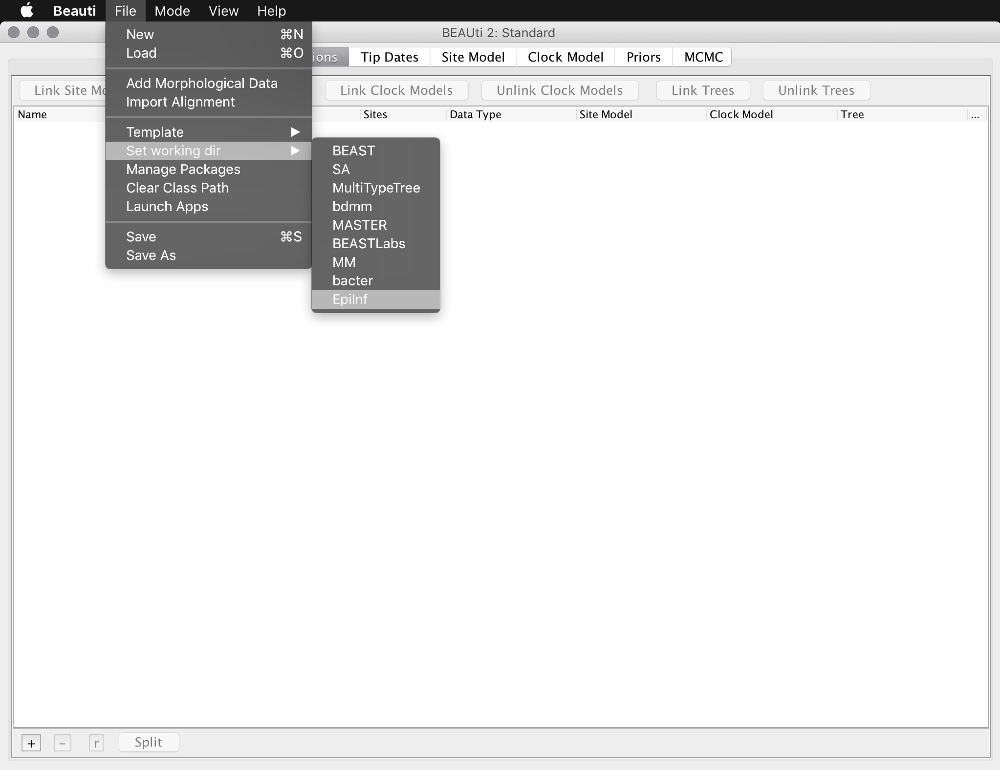{:.img-responsive}

Be aware that the previous step is only required for this tutorial: it is
just included to make it easier to locate the example data.  **It is not
required when loading your own data.**

Now import the simulated sequence alignment into BEAUti, which is named
"simulated_alignment.nexus":

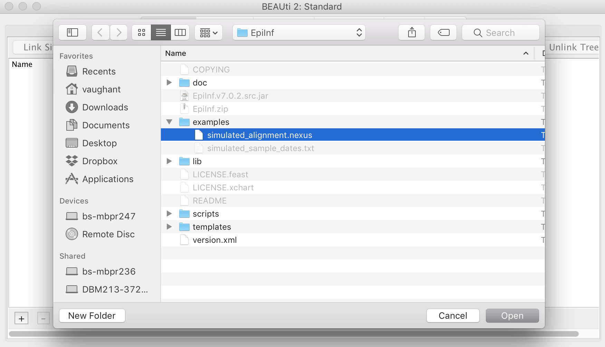{:.img-responsive}

Setting up site model, tip dates and clock model
------------------------------------------------

This sequence data were sampled over the entire period of the epidemic.
The simulated sample times are provided in a separate file named
"simulated_sample_ages.txt". This file contains a **tab-delimited** table
where each row contains a taxon (sequence) name and its associated age
with respect to the most recent sample:

    t0	0.0
    t1	0.02713882328
    t2	0.497098185552
    t3	0.789029282226
    t4	0.804044538371
    t5	1.01584369467
    t6	1.20734565128
    t7	1.28156508475
    t8	1.35845381067
    t9	1.35850615159
    ...

To assign these times to the sequences,
open the "Tip Dates" panel and select the check box "Use tip dates".
(Otherwise BEAUti will assume all sequences were sampled at a single
time.) Then, set the dates to be specified numerically as years **before the present** by selecting "before the present" from the combo-box.  Finally, press the "Auto-configure"
button, select "read from file" and choose the file "simulated_sample_ages.txt":

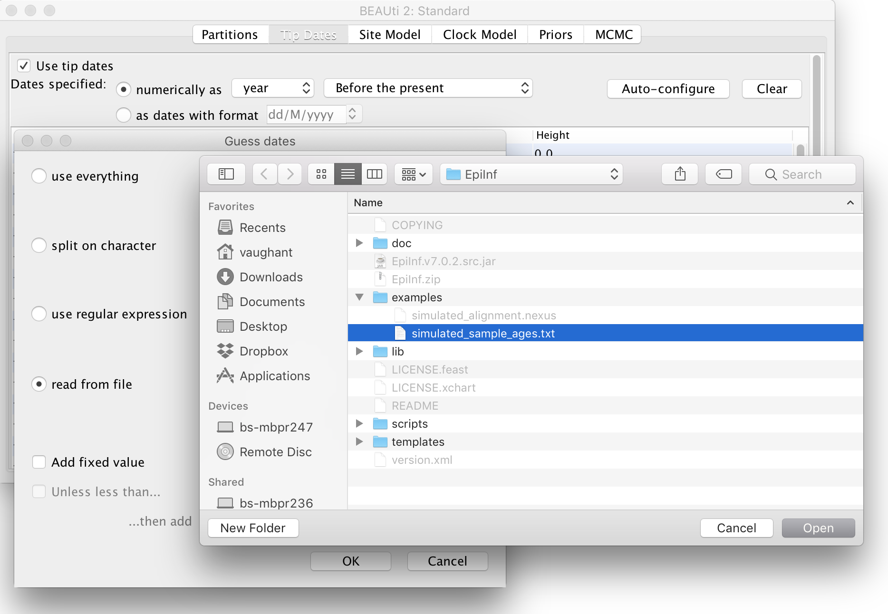{:.img-responsive}

The site (substitution) model we will use is the basic Jukes-Cantor
model.  Open the "Site Model" panel in BEAUti and ensure that this is
selected.  (It is the default.)  Be aware that this model should
generally not be used for real data: we are using it here only because
our data are artificial.

Similarly, we will use a strict clock model for this analysis.  Since we
have samples taken through time the clock rate becomes identifiable
and will thus be estimated by default.  To speed up the analysis we will
change the starting value of this rate to 0.01, which is closer to the
true value:

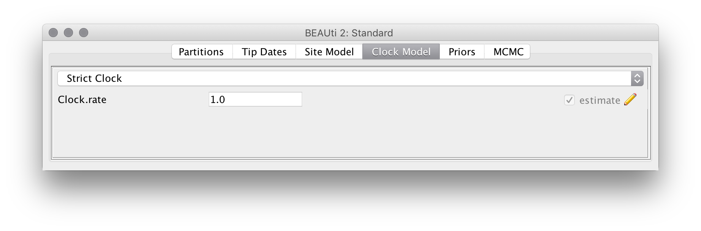{:.img-responsive}

Setting up the EpiInf tree prior
--------------------------------

The core of EpiInf is a particle filter based algorithm for computing transmission tree densities conditional on parameters of epidemiological models.  Switch to the "Priors" panel in BEAUti andselect "Epi Tree Prior" as the tree prior.  Then, expand the options for this prior by clicking the arrow immediately to the left.

For this analysis we will use just 20 particles per tree prior evaluation instead of the default 100.  Reducing this number increases the noise in the particle filter estimate of the tree prior density, but improves the speed of the analysis.  However, be aware that there is a trade-off: the increased noise can lead to slower mixing overall.

Select the "SIR model" from the list of epidemic models and select the option to "use sampling proportion instead of sampling rate". This causes the "psi sampling variable" to represent the sampling proportion (psi/(psi+mu)) rather than the absolute rate of the linear psi-sampling process. Deselect the "estimate" button to the right of the parameter.  The top portion of the prior
panel should now appear as below:

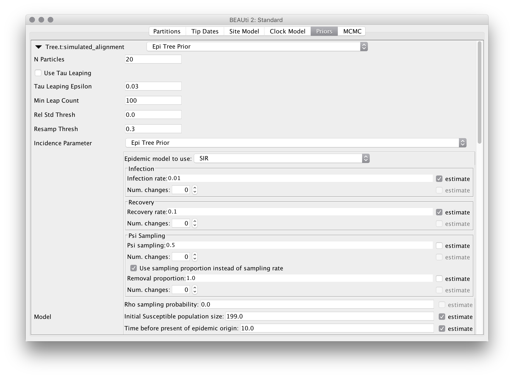{:.img-responsive}

Be aware that although we don't use this feature here, each of the
sampling rate, infection rate and recovery rate parameters may vary be
given the ability to vary in a piecewise-constant manner through time.
To allow for piecewise-constant variation, simply increase the
"Num. changes" values from 0 and specify the times at which the
changes should occur (as ages relative to the end of the sampling
period).  These ages can also be estimated by selecting the checkbox
that appears to their right.

Once the model and the intial parameter values are defined, the figure
at the bottom of the panel is updated to show a number of prevalence
trajectories simulated under that model.  For our configuration, you
should see something like the following:

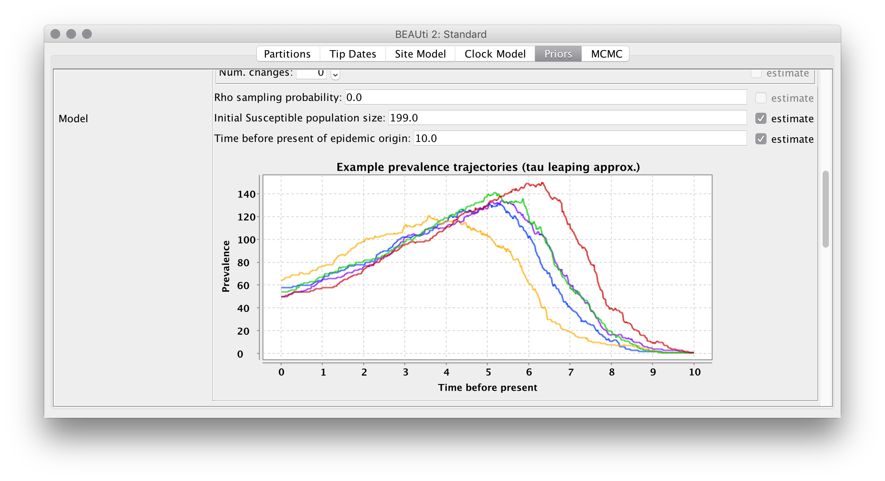{:.img-responsive}

Note that the variation between the example trajectories is purely due
to the noise in the demographic process.

Parameter priors
----------------

Finally, set the parameter priors as follows:

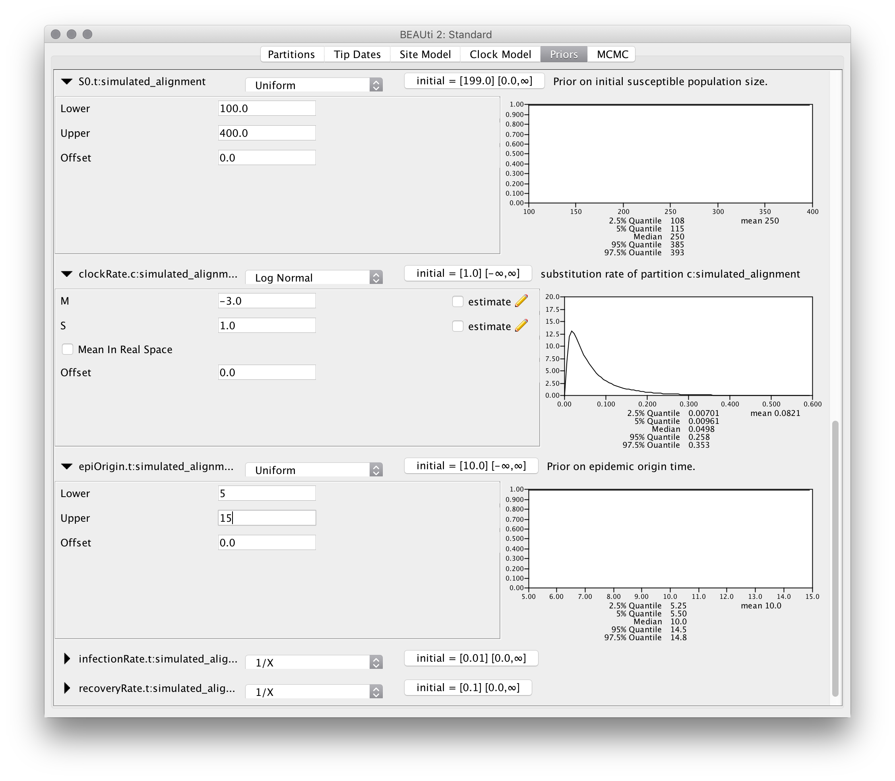{:.img-responsive}

MCMC options
------------

For this exampel analysis we will use a short chain of 2 million iterations.  To make things neater, we also change the output filenames for the trace, tree and trajectory logs to `tutorial.log`, `tutorial.trees` and `tutorial.traj`, respectively:

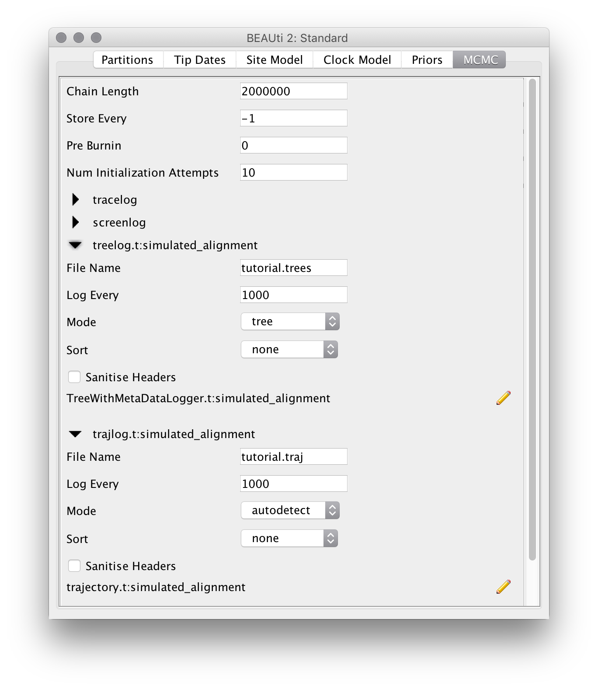{:.img-responsive}

Running the analysis
--------------------

Run the analysis just as you would any other BEAST 2 analysis. That is,

1.  Start BEAST 2.
2.  Select the XML you produced in the previous section from the file
    selection dialog box.

Once BEAST is running, you should see output periodically printed to
standard out (if you're running BEAST from a terminal emulator) or the
output window. The analysis we've set up should take around half an hour
to complete on a modern computer.

Analyzing the results
---------------------

During the analysis results are written to several files which can
usually located in the same directory as the directory containing the
input XML. These are:

1.  The **log** file, which ends in the extension .log and contains
    sampled parameter values,
2.  The **tree** file, which ends in the extension .trees and contains
    sampled trees.
2.  The **traj** file, which ends in the extension .traj and contains
    sampled stochastic population trajectories.

### Parameter posteriors

As usual, we can examine the posteriors for the model parameters by loading
the trace log file (here tutorial.log) into the programme Tracer:

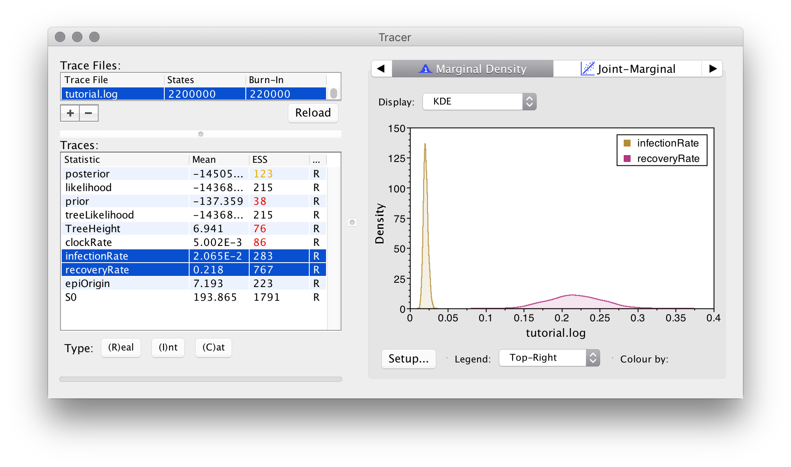{:.img-responsive}

Apart from the usual ESS values, something to pay close attention to in
EpiInf analyses is the trace for the tree height:

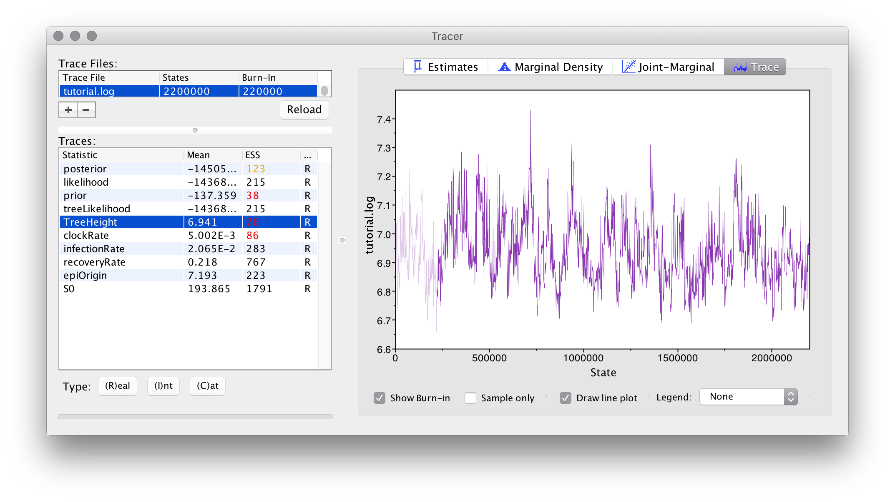{:.img-responsive}

If this trace contains large numbers of iterations where the sampled
value remained completely unchanged (became "stuck"), we are likely using
too few particles to compute the tree prior estimate, as noisy estimates
(which still being correct in the limit of an infinitely long chain)
produce this behaviour if the amplitude of the noise is too large.

Happily, we haven't observed this behaviour in our example analysis:
although you may wish to repeat the analysis with an even smaller
number of particles and compare the result.

### Tree posteriors

In this analysis we are largely uninterested in the sampled trees,
but of course they can be summarized and visualized in the same way as for
other BEAST 2 analyses.

### Trajectory posteriors

In order to visualize the trajectory posterior, we can use an R script
which is distributed with the EpiInf package.  To load this script,
start R and set the working directory (either using the `setwd()` or
using the appropriate menu option in your favourite R GUI) to the
directory containing your analysis output files.

Then, open the package manager in BEAUti (File-&gt;Manage packages) and
press the button marked "?" in the lower-right corner.  This should bring
up a message dialog explaining where to find installed BEAST 2 packages.
For instance, this is what appears on my system:

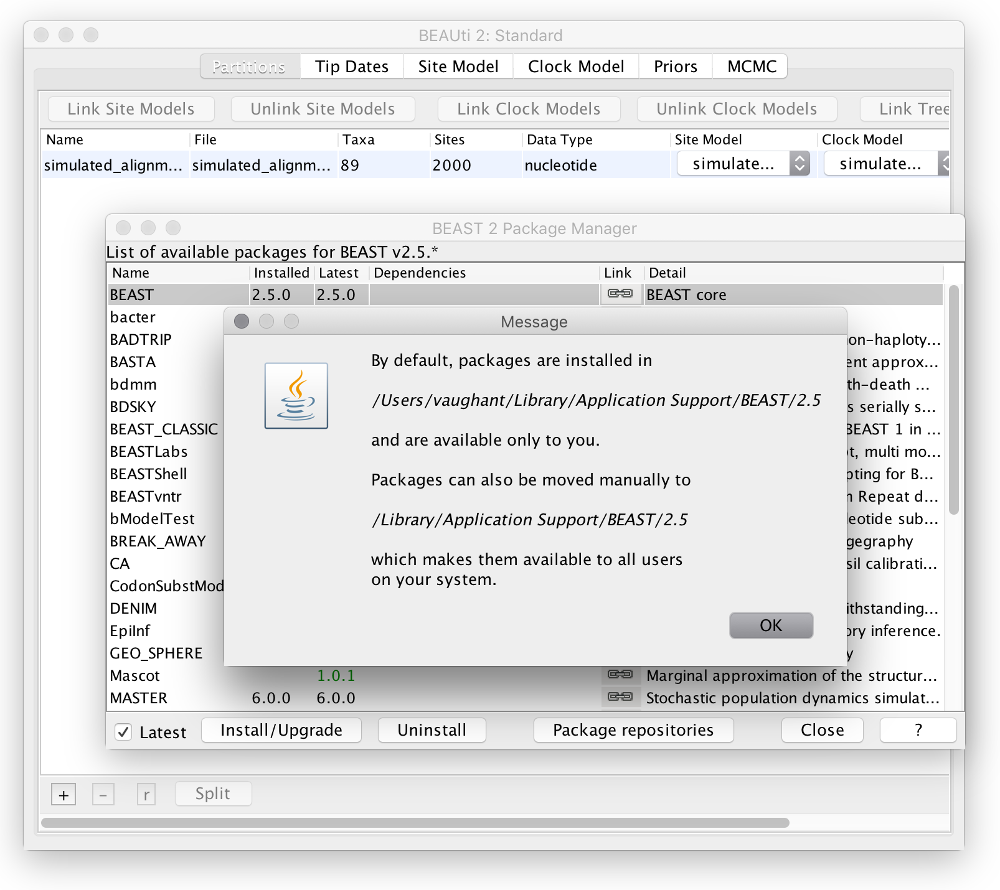{:.img-responsive}

which implies that my packages are installed in

    /users/vaughant/Library/Application Support/BEAST/2.5

The necessary R script can be found in the "scripts" directory
within the EpiInf package directory.  So on my system I can load
this using the following R command:

    > source("/users/vaughant/Library/Application Support/BEAST/2.5/EpiInf/scripts/plotTraj.R")

On your system the path will be different.

Once the script is loaded, the prevalence trajectory posterior
distribution can be visualized using the following command:

    plotTraj("tutorial.traj")

This should result in a figure similar to the following:

{:.img-responsive}

The coloured lines represent draws from the posterior, 
the dashed black lines represent the boundaries of the 95% highest
posterior density interval for the prevalence at each time, while
the solid black line represents the mean posterior prevalence.

To adjust the colour and/or opacity of the coloured lines, simply use
the "col" parameter:

    plotTraj("tutorial.traj", col=rgb(0,0,1,0.05))
    
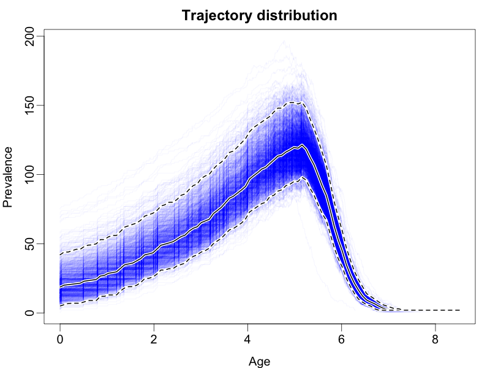{:.img-responsive}

Furthermore, the plotTraj command accepts all of the standard `plot()`
commands such as xlim, ylim, xlab, ylab, main, log, etc.

Wrapping up
-----------

This completes the first tutorial. In a future tutorial we will
demonstrate how to use EpiInf to analyze a combination of genetic
and non-genetic data.
